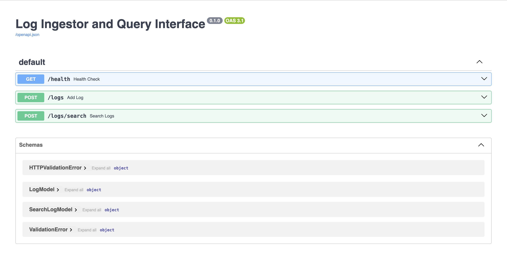
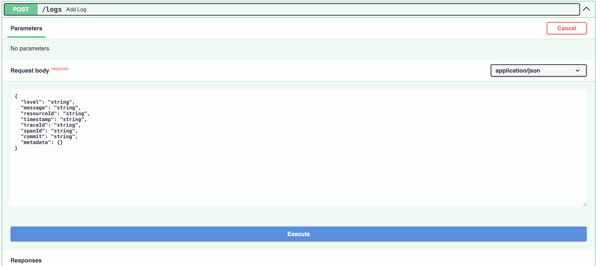
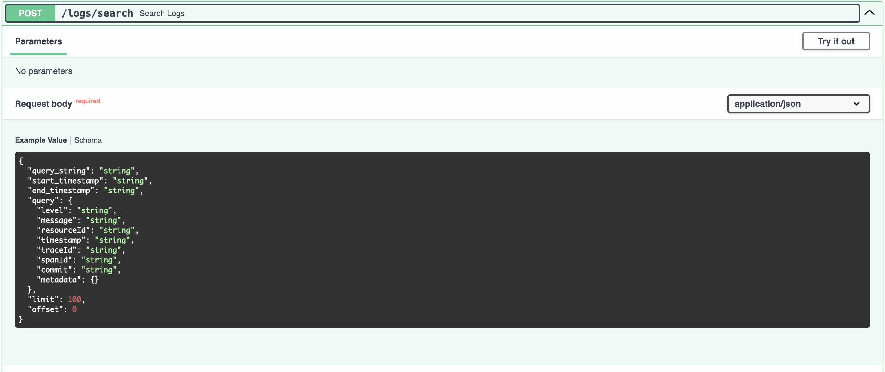
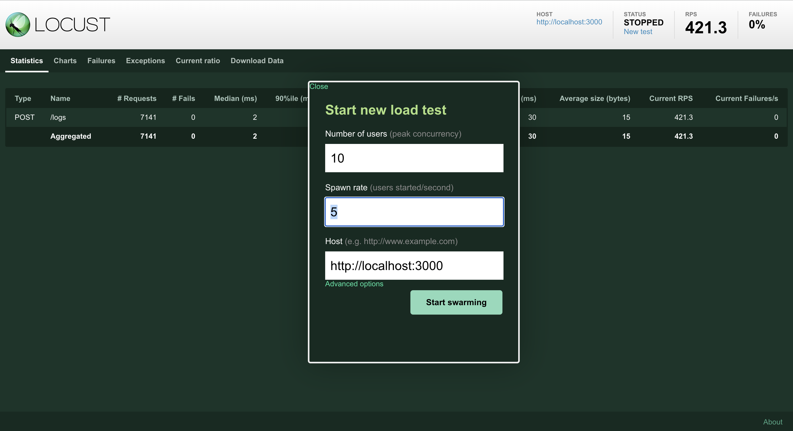
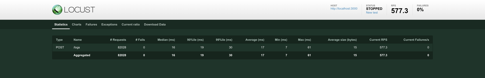
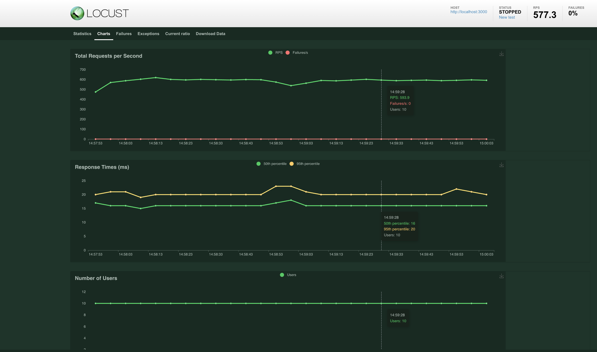

[](https://classroom.github.com/a/2sZOX9xt)

<a id="readme-top" name="readme-top"></a>

<br />
<div align="center">
  <h3 align="center">Log Ingestor System</h3>
</div>

<!-- TABLE OF CONTENTS -->
<details>
  <summary>Table of Contents</summary>
  <ol>
    <li>
      <a href="#about-the-project">About The Project</a>
      <ul>
        <li><a href="#built-with">Built With</a></li>
      </ul>
    </li>
    <li>
      <a href="#getting-started">Getting Started</a>
      <ul>
        <li><a href="#prerequisites">Prerequisites</a></li>
        <li><a href="#installation">Installation</a></li>
        <li><a href="#run">Run</a></li>
        <li><a href="#test">Test</a></li>
      </ul>
    </li>
    <li><a href="#usage">Usage</a></li>
    <li><a href="#contact">Contact</a></li>
  </ol>
</details>

<!-- ABOUT THE PROJECT -->

## About The Project



Developed a log ingestor system that can efficiently handle vast volumes of log data, and offer a simple interface for querying the data using full-text search or specific field filters.

<p align="right">(<a href="#readme-top">back to top</a>)</p>

### Built With

- [![Python][Python.org]][Python-url]
- [![FastAPI][FastAPI.com]][FastAPI-url]
- [![Elasticsearch][Elasticsearch.co]][Elasticsearch-url]
- [![Swagger][Swagger.io]][Swagger-url]

<p align="right">(<a href="#readme-top">back to top</a>)</p>

<!-- GETTING STARTED -->

## Getting Started

### Prerequisites

- Python
- Docker Desktop

### Installation

1. Clone the repo
   ```sh
   git clone https://github.com/dyte-submissions/november-2023-hiring-wp1122.git
   ```
2. Create Python Environment
   ```sh
   python -m venv venv
   source venv/bin/activate
   ```
3. Create Elasticsearch Database Instance using Docker Compose
   ```sh
   docker-compose up
   ```
4. Install requirements
   ```sh
   pip install -r requirements.txt
   ```

### Run

Run your FastAPI server using following uvicorn command:

```sh
uvicorn --host 0.0.0.0 --port 3000 src.app:app --reload
```

Interact with Swagger UI by opening http://localhost:3000 in browser





### Test

Used Locust to ingest logs and measure the performance by load tester.
Performs with throughput of 570 rps and latency 17ms for 10 concurrent users.

To run Locust at http://localhost:8089 :

```
locust
```





<p align="right">(<a href="#readme-top">back to top</a>)</p>

## Usage

- Real-time log ingestion and searching capability
- Add logs to the database by making POST request at `/logs` with payload as the following:
  ```
  {
      "level": "string",
      "message": "string",
      "resourceId": "string",
      "timestamp": "string",
      "traceId": "string",
      "spanId": "string",
      "commit": "string",
      "metadata": {
          "parentResourceId": "string"
      }
  }
  ```
  Example cURL request for the same
  ```
  curl -X 'POST' \
      'http://localhost:3000/logs' \
      -H 'accept: application/json' \
      -H 'Content-Type: application/json' \
      -d '{
      "level": "error",
      "message": "Failed to connect to DB",
      "resourceId": "server-1234",
      "timestamp": "2023-09-15T08:00:00Z",
      "traceId": "abc-xyz-123",
      "spanId": "span-456",
      "commit": "5e5342f",
      "metadata": {
          "parentResourceId": "server-0987"
      }
  }'
  ```
- Query logs using Swagger UI as web interface with following features:

  - Full-text search
  - Search with specific field filters
  - Search within specific date ranges
  - Search with multiple filters combined
  - Search with regular expression
  - Supports Pagination

  Query logs by making POST request at `/logs/search` with following payload:

  ```
  {
      "query_string": "string",   // use this field for full-text search
      "start_timestamp": "string",    // use this field to specify start-time
      "end_timestamp": "string",  // use this field to specify end-time
      "query": {  // use this object for specific field filters search
          "level": "string",
          "message": "string",
          "resourceId": "string",
          "timestamp": "string",
          "traceId": "string",
          "spanId": "string",
          "commit": "string",
          "metadata": {}
      },
      "limit": 100,   // use this for pagination(number of results)
      "offset": 0     // use this for pagination(index of result to start from)
  }
  ```

  Example cURL query

  ```
  curl -X 'POST' \
      'http://localhost:3000/logs/search' \
      -H 'accept: application/json' \
      -H 'Content-Type: application/json' \
      -d '{
      "query_string": "connect server",
      "start_timestamp": "2023-09-10T00:00:00Z",
      "end_timestamp": "2023-09-15T23:59:59Z",
      "query": {
          "level": "error",
          "message": "Failed to connect",
          "resourceId": "server-1234"
      },
      "limit": 100,
      "offset": 0
  }'
  ```

<p align="right">(<a href="#readme-top">back to top</a>)</p>

<!-- CONTACT -->

## Contact

Ayush Chaudhary - [@ayush0011](https://www.linkedin.com/in/ayush0011/) - acayush2002@example.com

Project Link: [https://github.com/dyte-submissions/november-2023-hiring-wp1122](https://github.com/dyte-submissions/november-2023-hiring-wp1122)

<p align="right">(<a href="#readme-top">back to top</a>)</p>

[linkedin-shield]: https://img.shields.io/badge/-LinkedIn-black.svg?style=for-the-badge&logo=linkedin&colorB=555
[linkedin-url]: https://linkedin.com/in/othneildrew
[Python.org]: https://img.shields.io/badge/python-3670A0?style=for-the-badge&logo=python&logoColor=ffdd54
[Python-url]: https://www.python.org/
[FastAPI.com]: https://img.shields.io/badge/FastAPI-005571?style=for-the-badge&logo=fastapi
[FastAPI-url]: https://fastapi.tiangolo.com/
[Swagger.io]: https://img.shields.io/badge/-Swagger-%23Clojure?style=for-the-badge&logo=swagger&logoColor=white
[Swagger-url]: https://swagger.io/
[Elasticsearch.co]: https://img.shields.io/badge/-ElasticSearch-005571?style=for-the-badge&logo=elasticsearch
[Elasticsearch-url]: https://www.elastic.co/
